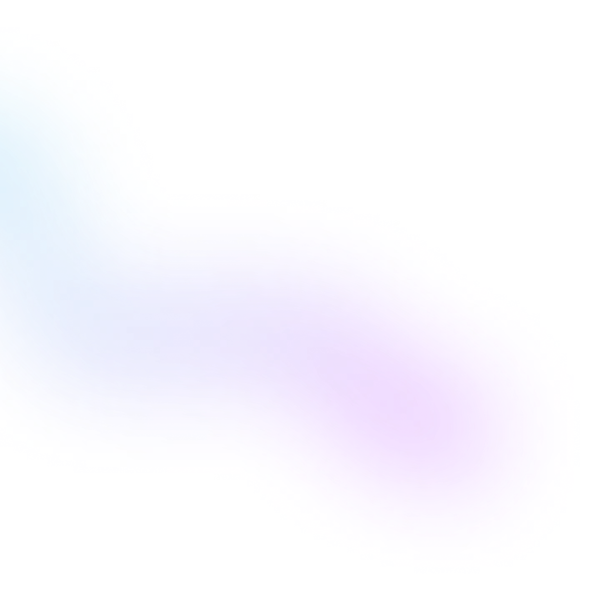
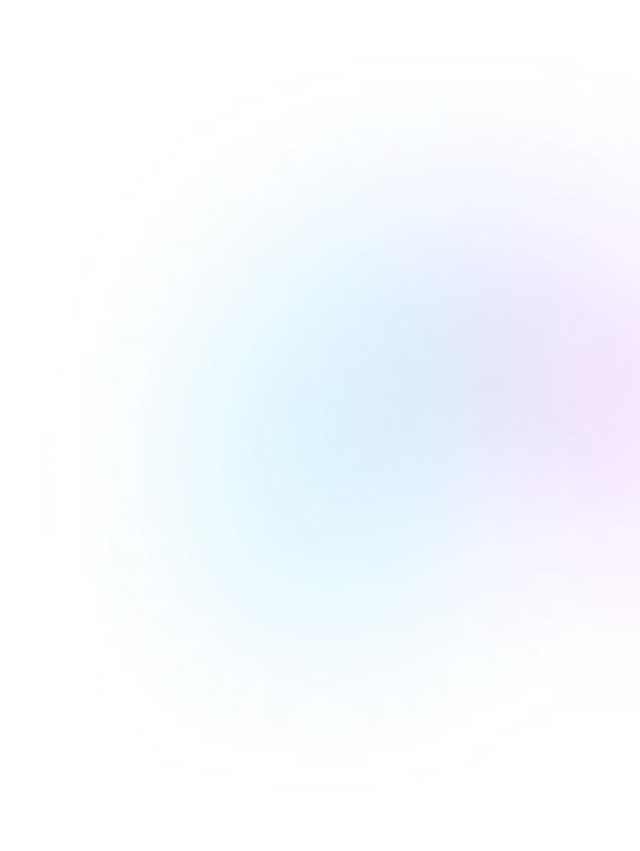

<!-- Формула расчета ширины flex єлемента в сетке -->
.element {
  flex-basis: calc((100% - кол-во маржинов в строке * значение маржина) / кол-во элементов в строке);
}

<!-- Скрипт мобильного меню -->
(() => {
	const menuBtnRef = document.querySelector("[data-menu-button]");
	const mobileMenuRef = document.querySelector("[data-menu]");
  
	menuBtnRef.addEventListener("click", () => {
	  const expanded =
		menuBtnRef.getAttribute("aria-expanded") === "true" || false;
  
	  menuBtnRef.classList.toggle("is-open");
	  menuBtnRef.setAttribute("aria-expanded", !expanded);
  
	  mobileMenuRef.classList.toggle("is-open");
	});
  })();

  <!-- Mobile Menu -->
  (() => {
  const mobileMenu = document.querySelector('.js-menu-container');
  const openMenuBtn = document.querySelector('.js-open-menu');
  const closeMenuBtn = document.querySelector('.js-close-menu');

  const toggleMenu = () => {
    const isMenuOpen =
      openMenuBtn.getAttribute('aria-expanded') === 'true' || false;
    openMenuBtn.setAttribute('aria-expanded', !isMenuOpen);
    mobileMenu.classList.toggle('is-open');

    const scrollLockMethod = !isMenuOpen
      ? 'disableBodyScroll'
      : 'enableBodyScroll';
    bodyScrollLock[scrollLockMethod](document.body);
  };

  openMenuBtn.addEventListener('click', toggleMenu);
  closeMenuBtn.addEventListener('click', toggleMenu);

  // Close the mobile menu on wider screens if the device orientation changes
  window.matchMedia('(min-width: 768px)').addEventListener('change', e => {
    if (!e.matches) return;
    mobileMenu.classList.remove('is-open');
    openMenuBtn.setAttribute('aria-expanded', false);
    bodyScrollLock.enableBodyScroll(document.body);
  });
})();

<!-- Пакетне завантеження картинок з Фігми -->
img-$N
img-$N_mob
img-$N_tablet
img-$N_desk

Дескриптор W
Изменить размер в Export картинки в Фигме
img-$N

<!-- Адаптивний шрифт -->
font-size: calc(24px + 16 * ((100vw - 320px) / (1280 - 320)));

SCSS Миксин:
$maxWidth: 1280;
@mixin adaptiv-font($pcSize, $mobSize) {
 $addSize: $pcSize - $mobSize;
 $maxWidth: $maxWidth - 320;
 font-size: calc(#{$mobSize + px} + #{$addSize} * ((100vw - 320px) / #{$maxWidth}));
}

<!-- Адаптація контентних зображень під ретіна екрани (розмір фіксований) -->

<!-- Адаптація контентних зображень під ретіна екрани (розмір залежить від типу пристрою) -->

<!-- Розміри зображень вираховуються віносно розміру в’юпорту -->

<!-- Адаптація контентних зображень під ретіна екрани (залежно від формату і кадрування зображення) -->
<picture>
  <!-- Desktop screen -->
  <source
    media="(min-width: 1200px)"
    srcset="
      ./images/portfolio/img-1_lg.webp    1x,
      ./images/portfolio/img-1_lg@2x.webp 2x
    "
    type="image/webp"
  />
  <source
    media="(min-width: 1200px)"
    srcset="
      ./images/portfolio/img-1_lg.jpg    1x,
      ./images/portfolio/img-1_lg@2x.jpg 2x
    "
    type="image/jpg"
  />
  <!-- Tablet screen -->
  <source
    media="(min-width: 768px)"
    srcset="
      ./images/portfolio/img-1_md.webp    1x,
      ./images/portfolio/img-1_md@2x.webp 2x
    "
    type="image/webp"
  />
  <source
    media="(min-width: 768px)"
    srcset="
      ./images/portfolio/img-1_md.jpg    1x,
      ./images/portfolio/img-1_md@2x.jpg 2x
    "
    type="image/jpg"
  />
  <!-- Mobile screen -->
  <source
    media="(max-width: 767px)"
    srcset="
      ./images/portfolio/img-1_sm.webp    1x,
      ./images/portfolio/img-1_sm@2x.webp 2x
    "
    type="image/webp"
  />
  <source
    media="(max-width: 767px)"
    srcset="
      ./images/portfolio/img-1_sm.jpg    1x,
      ./images/portfolio/img-1_sm@2x.jpg 2x
    "
    type="image/jpg"
  />
  
</picture>

<!-- Адаптація фонових зображень під ретіна екрани -->
background-repeat: no-repeat;
background-position: center;
background-size: cover;

// Mobile screen
background-image: linear-gradient(to right, rgba(47, 48, 58, 0.4), rgba(47, 48, 58, 0.4)),
  url(../images/hero/bg-img_sm.jpg);

@media (min-device-pixel-ratio: 2), (min-resolution: 192dpi), (min-resolution: 2dppx) {
  background-image: linear-gradient(to right, rgba(47, 48, 58, 0.4), rgba(47, 48, 58, 0.4)),
    url(../images/hero/bg-img_sm@2x.jpg);
}

// Tablet screen
@media screen and (min-width: 481px) {
  background-image: linear-gradient(to right, rgba(47, 48, 58, 0.4), rgba(47, 48, 58, 0.4)),
    url(../images/hero/bg-img_md.jpg);

  @media (min-device-pixel-ratio: 2), (min-resolution: 192dpi), (min-resolution: 2dppx) {
    background-image: linear-gradient(to right, rgba(47, 48, 58, 0.4), rgba(47, 48, 58, 0.4)),
      url(../images/hero/bg-img_md@2x.jpg);
  }
}

// Desktop screen
@media screen and (min-width: 769px) {
  @include section(200px, 200px);

  background-image: linear-gradient(to right, rgba(47, 48, 58, 0.4), rgba(47, 48, 58, 0.4)),
    url(../images/hero/bg-img_lg.jpg);

  @media (min-device-pixel-ratio: 2), (min-resolution: 192dpi), (min-resolution: 2dppx) {
    background-image: linear-gradient(to right, rgba(47, 48, 58, 0.4), rgba(47, 48, 58, 0.4)),
      url(../images/hero/bg-img_lg@2x.jpg);
  }
}

<picture class="features__img">
	<!-- Desktop screen -->
	<source
		media="(min-width: 1280px)"
		srcset="
		./images/features/img-1_desk.webp    1x,
		./images/features/img-1_desk@2x.webp 2x
		"
		type="image/webp"
	/>
	<source
		media="(min-width: 1280px)"
		srcset="
		./images/features/img-1_desk.png     1x,
		./images/features/img-1_desk@2x.png 2x
		"
		type="image/jpg"
	/>
	<!-- Tablet screen -->
	<source
		media="(min-width: 768px)"
		srcset="
		./images/features/img-1_tab.webp    1x,
		./images/features/img-1_tab@2x.webp 2x
		"
		type="image/webp"
	/>
	<source
	media="(min-width: 768px)"
	srcset="
		./images/features/img-1_tab.png    1x,
		./images/features/img-1_tab@2x.png 2x
	"
	type="image/jpg"
	/>
	<!-- Mobile screen -->
	<source
	media="(max-width: 767px)"
	srcset="
		./images/features/img-1_mob.webp    1x,
		./images/features/img-1_mob@2x.webp 2x
	"
	type="image/webp"
	/>
	<source
	media="(max-width: 767px)"
	srcset="
		./images/features/img-1_mob.png    1x,
		./images/features/img-1_mob@2x.png 2x
	"
	type="image/jpg"
	/>
	
</picture>

	<picture class="decor__glow--large">
		<!-- Desktop screen -->
		<source
		media="(min-width: 1280px)"
		srcset="
			./images/features/glow-1_desk.webp    1x,
			./images/features/glow-1_desk@2x.webp 2x
		"
		type="image/webp"
		/>
		<source
		media="(min-width: 1280px)"
		srcset="
			./images/features/glow-1_desk.png     1x,
			./images/features/glow-1_desk@2x.png 2x
		"
		type="image/jpg"
		/>
		<!-- Tablet screen -->
		<source
			media="(min-width: 768px)"
			srcset="
			./images/features/glow-1_tab.webp    1x,
			./images/features/glow-1_tab@2x.webp 2x
			"
			type="image/webp"
		/>
	<source
		media="(min-width: 768px)"
		srcset="
		./images/features/glow-1_tab.png    1x,
		./images/features/glow-1_tab@2x.png 2x
		"
		type="image/jpg"
		/>
	<!-- Mobile screen -->
	<source
		media="(max-width: 767px)"
		srcset="
		./images/features/glow-1_mob.webp    1x,
		./images/features/glow-1_mob@2x.webp 2x
		"
		type="image/webp"
	/>
	<source
		media="(max-width: 767px)"
		srcset="
		./images/features/glow-1_mob.png    1x,
		./images/features/glow-1_mob@2x.png 2x
		"
		type="image/jpg"
	/>
	
	</picture>

	<picture class="decor__glow--small">
		<!-- Desktop screen -->
		<source
			media="(min-width: 1280px)"
			srcset="
			./images/features/glow-2_desk.webp    1x,
			./images/features/glow-2_desk@2x.webp 2x
			"
			type="image/webp"
		/>
		<source
			media="(min-width: 1280px)"
			srcset="
			./images/features/glow-2_desk.png     1x,
			./images/features/glow-2_desk@2x.png 2x
			"
			type="image/jpg"
		/>
		<!-- Tablet screen -->
		<source
			media="(min-width: 768px)"
			srcset="
			./images/features/glow-2_tab.webp    1x,
			./images/features/glow-2_tab@2x.webp 2x
			"
			type="image/webp"
			/>
		<source
		media="(min-width: 768px)"
		srcset="
			./images/features/glow-2_tab.png    1x,
			./images/features/glow-2_tab@2x.png 2x
		"
		type="image/jpg"
			/>
		<!-- Mobile screen -->
		<source
		media="(max-width: 767px)"
		srcset="
			./images/features/glow-2_mob.webp    1x,
			./images/features/glow-2_mob@2x.webp 2x
		"
		type="image/webp"
		/>
		<source
		media="(max-width: 767px)"
		srcset="
			./images/features/glow-2_mob.png    1x,
			./images/features/glow-2_mob@2x.png 2x
		"
		type="image/jpg"
		/>
		
	</picture>
	

	<!-- Button -->

	<button class="btn" type="button">
				Download
			  </button>

	<!-- Style Button -->

	.btn {
	position: relative;
  
	display: block;
	padding: 0;
	min-width: 200px;
	min-height: 42px;
  
	font-weight: 700;
	font-size: 16px;
	line-height: 1.19;
	text-align: center;
	color: #ffffff;
  
	border-radius: 5px;
	border: none;
  
	overflow: hidden;
	cursor: pointer;

	&::after,
	&::before {
	  content: "";
	  position: absolute;
	  top: 50%;
	  left: 50%;
	  transform: translate(-50%, -50%);
	  display: block;
	}
  
	&::before {
	  width: 100%;
	  height: 100%;
	  background-image: linear-gradient(90deg, #00c5eb -2%, #b544fe 90%);
	  background-size: cover;
	  background-repeat: no-repeat;

	  animation: animatebg 1000ms ease infinite paused;
	}
  
	&::after {
	  width: calc(100% - 2px);
	  height: calc(100% - 2px);
	  border-radius: 5px;
	  background-color: #06071b;
	  opacity: 0;
	  transition: 300ms;
	}
  
	&__text {
	  position: relative;
	  z-index: 10;
	}
  }
  
  .btn:hover::after,
  .btn:focus::after {
	opacity: 1;
  }
  
 data-aos="fade-down"

 data-aos="flip-down"